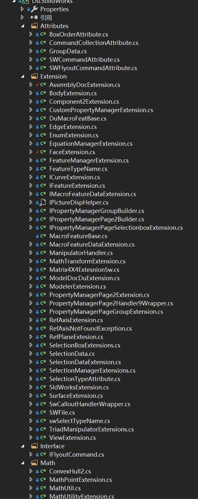

<div align=center></div>


# DuSolidWorksExtension

English | [中文](https://github.com/weianweigan/DuSolidWorksExtension/blob/master/README.cn.md)

Lots of very useful extension methods for SolidWorks api.

Based on https://github.com/Weingartner/SolidworksAddinFramework


## Install

```
PM> Install-Package Du.SolidWorks -Version 0.1.1
```

## Usage

### 1. Add namespace firstly

```
using Du.SolidWorks.Extension;
using Du.SolidWorks.Math
```

### 2. You can use almost extension methods 

* EquatiomMgr Extension Methods

 


```csharp
var doc = _addin.SwApp.ActiveDoc as ModelDoc2;

var equ = doc.GetEquationMgr().GetAllEqu().
          Where(p => p.GlobalVariable).Select(p => p.VarName);
```

----------------------------------------------------------------------------
----------------------------------------------------------------------------

* CustomPropertyManager Extension Methos 


```csharp
var doc = _addin.SwApp.ActiveDoc as ModelDoc2;

var dateProerty = doc.Extension.CustomPropertyManager[""].GetAllProperty()
                ?.Where(p => p.Value.Contains("日期"))?.Select(p => p.Name);
```

## Document 

* Document is being written :construction:

* [Click here to See Auto Generated Document](https://weianweigan.github.io/DuSolidWorksExtension/) 
    
  ----Du.SolidWorks.Extension (  extension methods in this namespace)

* some useful chinese document

    1.[向量计算(为SolidWorks写扩展方法)](https://www.jianshu.com/p/ba0eb8869d31)

    2.[Linq查询](https://www.jianshu.com/p/350b7739ab79)

* interfaces 



## Contact me

